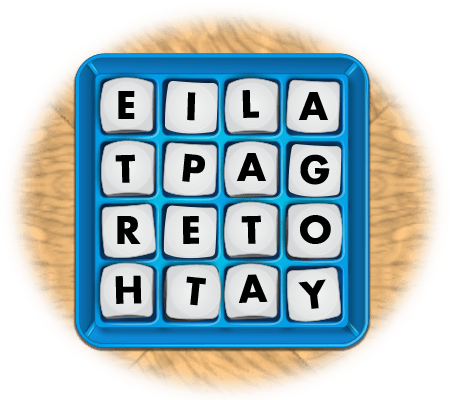

# Boggle Solver



### Problem definition

This repository contains a Python script that takes as input an arbitrary grid of letters and finds all words in the grid according to the rules of Boggle. The list of accepted words is the list provided by [OpenTaal](https://github.com/OpenTaal/opentaal-wordlist).

A working example can be found in `notebooks/main.ipynb`. 

## Example

```python
boggle_string = 'abcdefghijklmnop'
boggle_grid = BoggleGrid(np.resize([x for x in boggle_string],(4,4)))
boggle = Boggle(boggle_grid,word_list)
all_words = boggle.solve()

print('--- BOGGLE ---\n')
print(boggle_grid)

print('\n\n--- ALL WORDS ---\n')
print([word['word'] for word in all_words])

--- BOGGLE ---

[['a' 'b' 'c' 'd']
 ['e' 'f' 'g' 'h']
 ['i' 'j' 'k' 'l']
 ['m' 'n' 'o' 'p']]


--- ALL WORDS ---

['abc', 'bef', 'bei', 'baf', 'cfk', 'fij', 'feb', 'glo', 'ijk', 'ino', 'ink', 'jok', 'jol', 'kop', 'kon', 'kol', 'kno', 'lok', 'mij', 'min', 'mie', 'nop', 'nok', 'nol', 'pon', 'pok', 'pol', 'fijn', 'glop', 'jonk', 'jein', 'klop', 'knop', 'knol', 'knie', 'lonk', 'mijn', 'mink', 'ponk', 'polk', 'plok', 'afijn', 'ojief']
```